# SeeOmKus QR

Aplikasi web untuk **membuat (generate) QR Code** dari data yang diinput dan **membaca (scan) QR Code** memakai kamera handphone, webcam laptop, atau PC. Hasil scan ditampilkan sebagai informasi yang mudah dibaca.

- **Website:** [www.seeomkus.com](https://www.seeomkus.com)
- **Versi:** 1.0.0
- **Rilis:** Oktober 2026
- **Browser yang didukung:** Google Chrome (desktop dan Android)

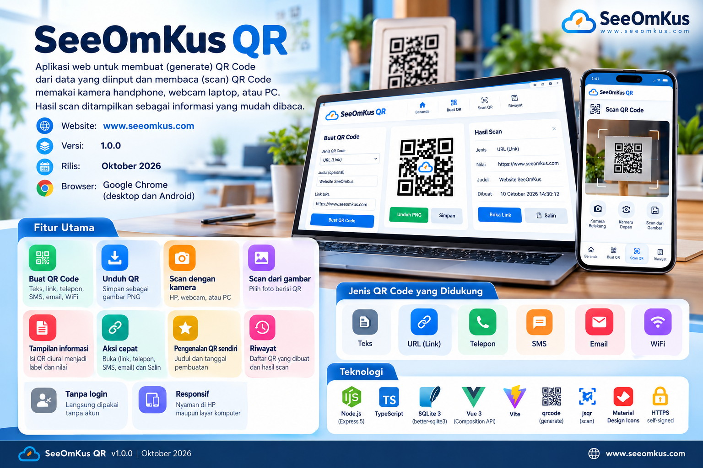

*Infografis SeeOmKus QR. Tampilan layar pada gambar berupa ilustrasi; tampilan sebenarnya dapat sedikit berbeda. Versi potret tersedia di [seeomkus-qr-webapp-infographic-portrait.png](seeomkus-qr-webapp-infographic-portrait.png).*

---

## Daftar Isi

1. [Fitur](#1-fitur)
2. [Teknologi](#2-teknologi)
3. [Struktur Proyek](#3-struktur-proyek)
4. [Persyaratan](#4-persyaratan)
5. [Instalasi dan Menjalankan](#5-instalasi-dan-menjalankan)
6. [Mengakses dari Handphone](#6-mengakses-dari-handphone)
7. [Panduan Penggunaan](#7-panduan-penggunaan)
8. [Jenis QR Code yang Didukung](#8-jenis-qr-code-yang-didukung)
9. [Arsitektur](#9-arsitektur)
10. [Database](#10-database)
11. [Referensi REST API](#11-referensi-rest-api)
12. [Konfigurasi](#12-konfigurasi)
13. [Mode Pengembangan](#13-mode-pengembangan)
14. [Keamanan dan Privasi](#14-keamanan-dan-privasi)
15. [Pemecahan Masalah](#15-pemecahan-masalah)
16. [Keterbatasan dan Pengembangan Lanjutan](#16-keterbatasan-dan-pengembangan-lanjutan)

---

## 1. Fitur

| Fitur | Keterangan |
|---|---|
| Buat QR Code | Input data sesuai jenis (teks, link, telepon, SMS, email, WiFi), lalu QR Code dibuat dan disimpan ke database |
| Unduh QR | QR Code dapat diunduh sebagai gambar PNG |
| Scan dengan kamera | Memakai kamera HP (depan/belakang) atau webcam laptop/PC |
| Scan dari gambar | Alternatif jika kamera tidak bisa dipakai: pilih foto/gambar berisi QR |
| Tampilan informasi | Isi QR diurai menjadi label dan nilai, misalnya nama WiFi, password, atau alamat web |
| Aksi cepat | Tombol **Buka** (link, telepon, SMS, email) dan **Salin** |
| Pengenalan QR sendiri | Jika QR yang di-scan dibuat lewat aplikasi ini, judul dan tanggal pembuatannya ikut tampil |
| Riwayat | Daftar QR yang dibuat dan hasil scan, lengkap dengan detail dan tombol hapus |
| Tanpa login | Langsung dipakai tanpa akun |
| Responsif | Nyaman di HP maupun layar komputer |

---

## 2. Teknologi

| Lapisan | Teknologi |
|---|---|
| Backend | Node.js, TypeScript, Express 5 |
| Database | SQLite 3 lewat `better-sqlite3` |
| Frontend | Vue 3 (Composition API, `<script setup>`), Vue Router, Vite |
| Pembuat QR | `qrcode` |
| Pembaca QR | `jsqr` (membaca frame dari `getUserMedia`) |
| Ikon | Material Design Icons (`@mdi/js`), diberi warna per ikon |
| HTTPS | Sertifikat self-signed dibuat otomatis dengan `selfsigned` |

---

## 3. Struktur Proyek

```
qr-code/
├── package.json            # skrip npm gabungan
├── qr.sh                   # pengelola aplikasi untuk Linux/macOS
├── qr.cmd                  # pengelola aplikasi untuk Windows
├── scripts/
│   └── manage.mjs          # logika install, build, start, stop, restart, status
├── docs/
│   └── screenshots/        # tangkapan layar aplikasi (PNG)
├── .run/                   # dibuat otomatis: PID dan log server
├── README.md               # dokumentasi ini
├── seeomkus-qr-webapp-infographic-landscape.png   # infografis (lanskap)
├── seeomkus-qr-webapp-infographic-portrait.png    # infografis (potret)
├── backend/
│   ├── package.json
│   ├── tsconfig.json
│   ├── src/
│   │   ├── server.ts       # server Express, rute API, penyajian frontend
│   │   ├── db.ts           # koneksi dan skema SQLite
│   │   └── cert.ts         # pembuatan sertifikat HTTPS self-signed
│   ├── dist/               # hasil build TypeScript (otomatis)
│   └── data/               # dibuat otomatis
│       ├── qrcode.db       # database SQLite
│       └── cert.json       # sertifikat HTTPS
└── frontend/
    ├── package.json
    ├── vite.config.ts
    ├── index.html
    ├── public/favicon.svg
    ├── dist/               # hasil build frontend (disajikan oleh backend)
    └── src/
        ├── main.ts         # inisialisasi Vue dan router
        ├── App.vue         # header, navigasi bawah, footer SeeOmKus
        ├── style.css       # gaya global
        ├── api.ts          # pemanggil REST API
        ├── payload.ts      # pembentuk dan pengurai isi QR
        ├── components/
        │   ├── Icon.vue    # ikon Material berwarna
        │   └── ScanInfo.vue# tampilan informasi hasil scan
        └── views/
            ├── Home.vue    # Beranda
            ├── Generate.vue# Buat QR
            ├── Scan.vue    # Scan QR
            └── History.vue # Riwayat
```

---

## 4. Persyaratan

- **Node.js 20 atau lebih baru** (dikembangkan dengan Node.js 22) dan npm.
- **Git** untuk mengunduh (clone) proyek dari GitHub.
- Google Chrome di komputer dan/atau HP.
- Untuk akses dari HP: komputer server dan HP berada di **jaringan Wi-Fi yang sama**.

---

## 5. Instalasi dan Menjalankan

### 5.1 Clone dari GitHub

Unduh proyek dari GitHub, lalu masuk ke foldernya. Repositori: [github.com/seeomkus/qr-code](https://github.com/seeomkus/qr-code).

```bash
git clone https://github.com/seeomkus/qr-code.git
cd qr-code
```

Atau memakai SSH:

```bash
git clone git@github.com:seeomkus/qr-code.git
cd qr-code
```

Untuk memperbarui ke versi terbaru di kemudian hari:

```bash
git pull
./qr.sh install     # Windows: qr install
./qr.sh restart     # Windows: qr restart
```

### 5.2 Menjalankan dengan script (disarankan)

Script pengelola tersedia untuk **Linux/macOS** (`qr.sh`) dan **Windows** (`qr.cmd`). Keduanya memanggil satu program yang sama (`scripts/manage.mjs`), sehingga perilakunya identik di semua sistem operasi dan tidak butuh dependensi tambahan selain Node.js.

| Perintah | Fungsi |
|---|---|
| `install` | Memasang dependensi backend dan frontend |
| `build` | Build frontend dan backend |
| `start` | Menjalankan server di **latar belakang**. Build otomatis dijalankan jika belum ada |
| `stop` | Menghentikan server |
| `restart` | Menghentikan lalu menjalankan ulang server |
| `status` | Menampilkan status, PID, waktu mulai, respons HTTP, dan alamat akses |
| `logs` | Menampilkan 50 baris log terakhir |

**Linux / macOS** (Terminal):

```bash
chmod +x qr.sh        # cukup sekali
./qr.sh install
./qr.sh build
./qr.sh start
./qr.sh status
./qr.sh restart
./qr.sh stop
```

Jika berkas tidak bisa dieksekusi, jalankan dengan `sh qr.sh start`.

**Windows** (Command Prompt atau PowerShell, di folder proyek):

```powershell
.\qr install
.\qr build
.\qr start
.\qr status
.\qr restart
.\qr stop
```

Di Command Prompt cukup `qr start`.

Contoh keluaran `start`:

```
[OK]    Server berjalan (PID 20064).

  Komputer : https://localhost:3443
  Handphone: https://192.168.22.87:3443
```

Hal yang perlu diketahui:

- Server berjalan di latar belakang, sehingga terminal bebas dipakai dan server tetap hidup setelah terminal ditutup. Server **tidak otomatis hidup lagi setelah komputer di-restart**; jalankan `start` kembali.
- PID dan waktu mulai disimpan di `.run/server.json`, log server di `.run/server.log`.
- `status` mengembalikan kode keluar `3` jika server berhenti, sehingga bisa dipakai di script otomatis.
- Port dan mode HTTP diatur lewat environment variable (lihat [Konfigurasi](#12-konfigurasi)). Contoh Linux: `PORT=8443 ./qr.sh start`. Contoh PowerShell: `$env:PORT = "8443"; .\qr start`.
- Satu folder proyek hanya menjalankan satu server. Perintah `start` saat server sudah berjalan tidak membuat proses kedua.

### 5.3 Menjalankan dengan npm (alternatif)

```bash
npm run install:all     # sama dengan: qr install
npm run build           # sama dengan: qr build
npm start               # server di terminal (foreground), hentikan dengan Ctrl + C
npm run app -- status   # menjalankan perintah pengelola apa pun, misalnya status
```

### 5.4 Alamat akses

Setelah server berjalan, alamat akses tampil di terminal (juga lewat `status`):

```
SeeOmKus QR berjalan:
  Komputer : https://localhost:3443
  Handphone: https://192.168.22.87:3443
```

Backend sekaligus menyajikan hasil build frontend, sehingga **hanya satu server dan satu port (3443)** yang perlu dijalankan.

---

## 6. Mengakses dari Handphone

### 6.1 Langkah

1. Pastikan HP dan komputer server terhubung ke Wi-Fi yang sama.
2. Jalankan `npm start` dan catat alamat bertanda **Handphone** di terminal.
3. Buka alamat tersebut di Chrome HP, misalnya `https://192.168.22.87:3443`.
4. Chrome menampilkan peringatan sertifikat. Pilih **Advanced** lalu **Proceed to ... (unsafe)**.
5. Buka menu **Scan**, tekan **Mulai Scan**, lalu pilih **Izinkan** saat Chrome meminta akses kamera.

### 6.2 Mengapa HTTPS dan peringatan sertifikat

Chrome hanya mengizinkan akses kamera pada *secure context*, yaitu HTTPS atau `localhost`. Karena HP mengakses lewat alamat IP jaringan, server memakai HTTPS. Sertifikatnya dibuat sendiri oleh aplikasi (self-signed), sehingga Chrome menampilkan peringatan. Peringatan ini wajar dan hanya perlu dilewati sekali per perangkat.

Sertifikat mencakup `localhost`, `127.0.0.1`, dan semua alamat IPv4 jaringan komputer saat sertifikat dibuat. Jika alamat IP komputer berubah, sertifikat dibuat ulang otomatis saat server dijalankan kembali.

### 6.3 Firewall

Jika HP tidak dapat membuka halaman, izinkan port 3443.

**Windows**: jalankan PowerShell **sebagai Administrator**:

```powershell
New-NetFirewallRule -DisplayName "SeeOmKus QR 3443" -Direction Inbound -Protocol TCP -LocalPort 3443 -Action Allow
```

**Linux**: sesuaikan dengan firewall yang dipakai.

```bash
sudo ufw allow 3443/tcp                              # Ubuntu/Debian (ufw)
sudo firewall-cmd --permanent --add-port=3443/tcp && sudo firewall-cmd --reload   # Fedora/RHEL (firewalld)
```

Jika komputer punya beberapa adapter jaringan (misalnya VMware atau VirtualBox), beberapa alamat IP akan tercetak. Gunakan alamat yang berada di jaringan Wi-Fi yang sama dengan HP.

---

## 7. Panduan Penggunaan

Tangkapan layar di bagian ini diambil dari aplikasi yang berjalan di Chrome, dalam ukuran layar HP (kiri ke kanan: Beranda, Buat QR, Scan, Riwayat) dan layar komputer.

| Beranda | Buat QR | Hasil Scan | Riwayat |
|:---:|:---:|:---:|:---:|
| 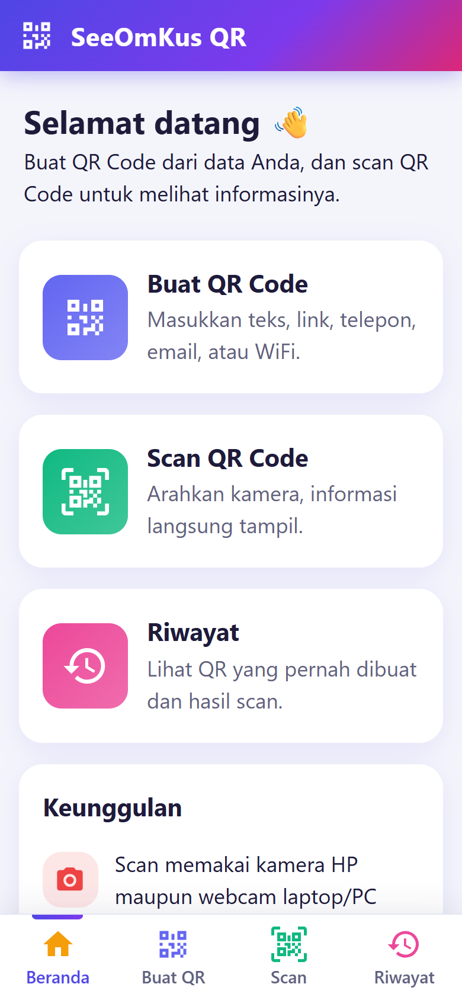 | 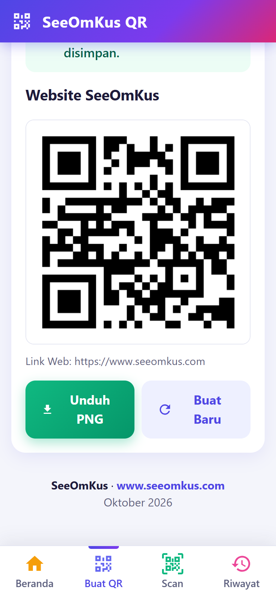 | 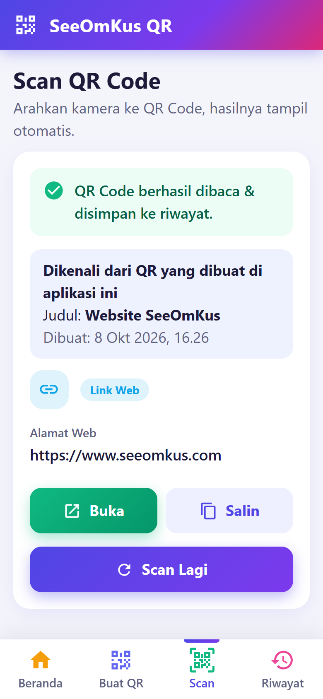 | 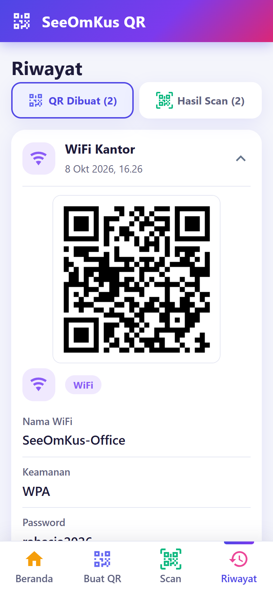 |

### 7.1 Beranda


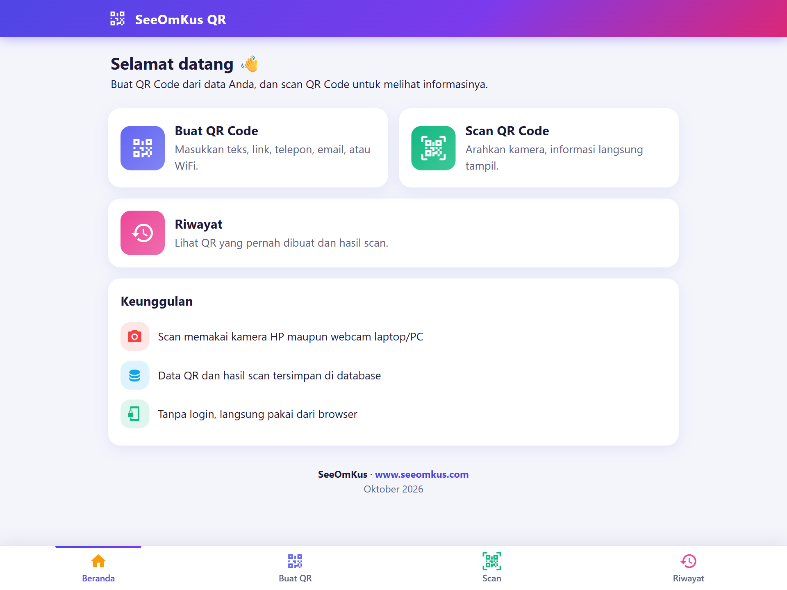
Berisi pintasan ke **Buat QR Code**, **Scan QR Code**, dan **Riwayat**. Navigasi utama berada di bar bawah layar.

### 7.2 Membuat QR Code

| Isi data | QR Code jadi |
|:---:|:---:|
| 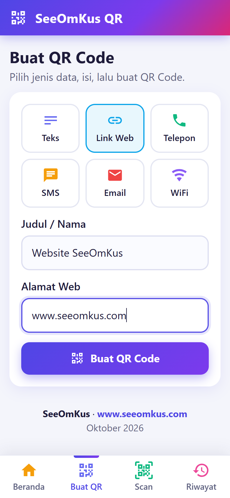 |  |

Tampilan di komputer (form di kiri, hasil di kanan):

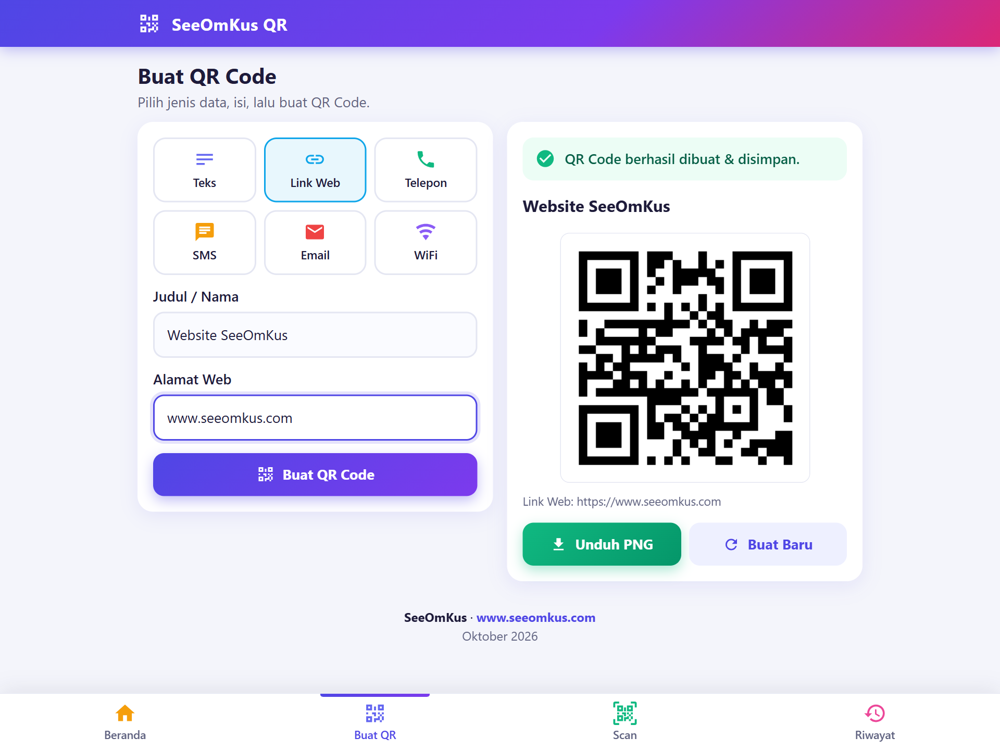
1. Buka menu **Buat QR**.
2. Pilih jenis data: Teks, Link Web, Telepon, SMS, Email, atau WiFi.
3. Isi **Judul / Nama** (wajib) sebagai penanda di riwayat.
4. Isi kolom data sesuai jenis yang dipilih.
5. Tekan **Buat QR Code**.
6. QR Code tampil dan otomatis tersimpan. Tekan **Unduh PNG** untuk menyimpan gambar, atau **Buat Baru** untuk mengulang.

### 7.3 Scan QR Code

| Sebelum scan | Hasil: WiFi | Hasil: Link Web |
|:---:|:---:|:---:|
| 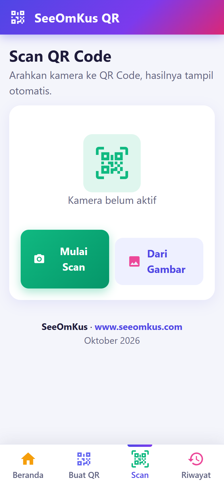 | 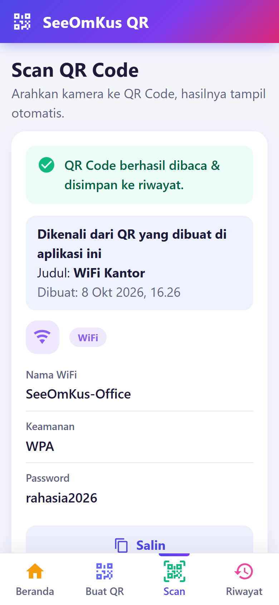 |  |

Catatan: tangkapan hasil scan di atas diambil lewat fitur **Dari Gambar**. Pembacaan lewat kamera menampilkan hasil yang sama.
1. Buka menu **Scan** lalu tekan **Mulai Scan**.
2. Izinkan akses kamera.
3. Arahkan kamera ke QR Code di dalam bingkai hijau. Pembacaan berjalan otomatis.
4. Hasil tampil beserta label informasi. Gunakan **Buka** atau **Salin** sesuai kebutuhan.
5. Tekan **Scan Lagi** untuk memindai QR berikutnya.

Tombol tambahan:
- **Ganti Kamera**: berpindah antara kamera belakang dan depan di HP, atau antar kamera di PC.
- **Berhenti**: mematikan kamera.
- **Dari Gambar**: membaca QR dari foto atau gambar yang dipilih, tanpa kamera.

Setiap hasil scan otomatis disimpan ke riwayat. Jika isinya sama dengan QR yang pernah dibuat di aplikasi ini, tampil kotak **"Dikenali dari QR yang dibuat di aplikasi ini"** berisi judul dan tanggal pembuatan.

### 7.4 Riwayat


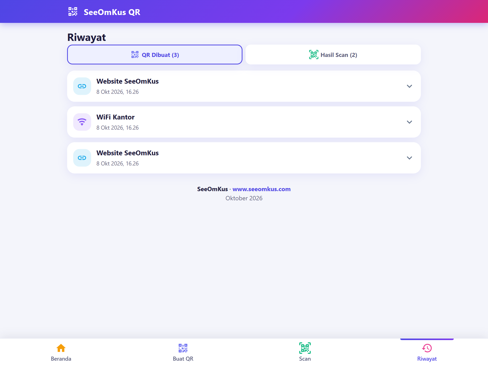
Terdapat dua tab:
- **QR Dibuat**: ketuk satu item untuk melihat gambar QR, isi data, dan tombol **Hapus**.
- **Hasil Scan**: ketuk satu item untuk melihat informasi hasil scan dan tombol **Hapus**.

Riwayat menampilkan maksimal 200 data terbaru per tab.

---

## 8. Jenis QR Code yang Didukung

Aplikasi memakai format QR standar, sehingga QR yang dibuat juga dapat dibaca oleh aplikasi scanner lain (kamera bawaan HP, Google Lens, dan sebagainya).

| Jenis | Kolom input | Format isi QR |
|---|---|---|
| Teks | Teks | Teks apa adanya |
| Link Web | Alamat web | `https://...` (jika belum ada skema, `https://` ditambahkan otomatis) |
| Telepon | Nomor telepon | `tel:08123456789` |
| SMS | Nomor tujuan, pesan | `SMSTO:08123456789:isi pesan` |
| Email | Alamat email, subjek, isi pesan (subjek dan isi opsional) | `mailto:nama@email.com?subject=...&body=...` |
| WiFi | Nama WiFi (SSID), keamanan (WPA/WPA2, WEP, tanpa password), password | `WIFI:T:WPA;S:NamaWiFi;P:password;;` |

Untuk WiFi, karakter khusus `\ ; , : "` pada SSID dan password otomatis di-escape sesuai standar.

Saat scan, isi yang tidak dikenali sebagai salah satu format di atas ditampilkan sebagai **Teks**.

Batas panjang data: 1800 karakter di sisi frontend, 2000 karakter di sisi backend.

---

## 9. Arsitektur

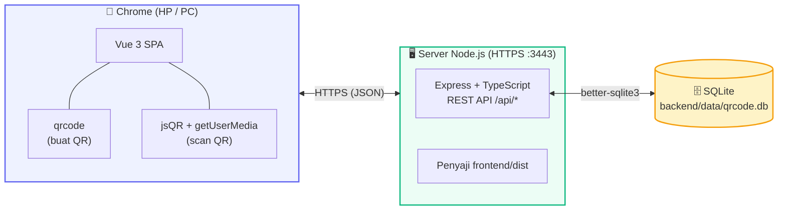

### 9.1 Alur Buat QR Code

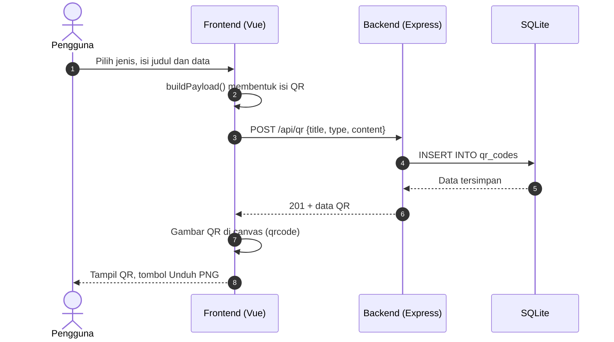

### 9.2 Alur Scan QR Code

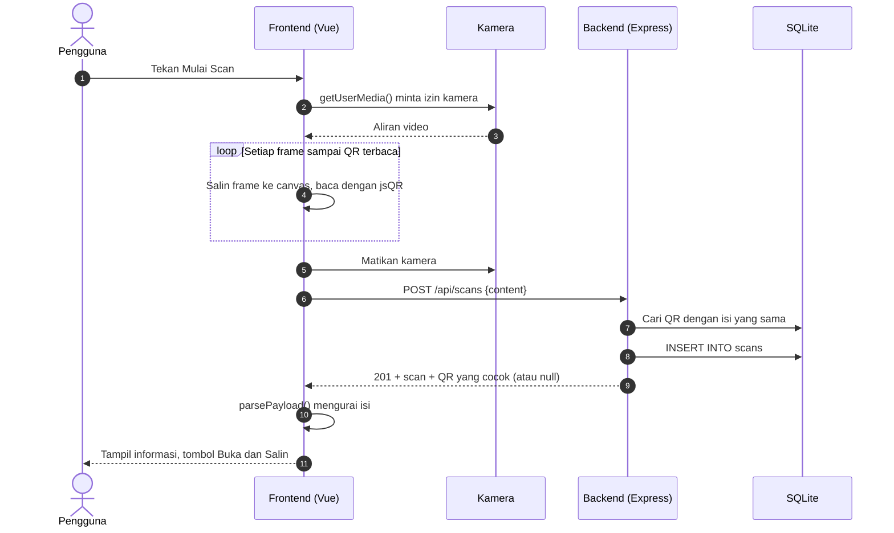

### 9.3 Alur Pembacaan Isi QR

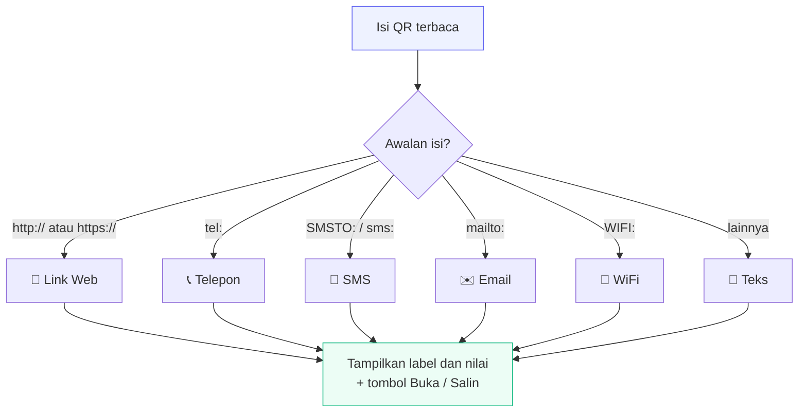

Alur kerja utama:

- **Generate:** frontend membentuk isi QR (`buildPayload`), mengirim `title`, `type`, dan `content` ke `POST /api/qr`, lalu menggambar QR di `<canvas>` memakai pustaka `qrcode`.
- **Scan:** frontend membuka kamera (`getUserMedia`), menyalin frame video ke canvas, dan membacanya dengan `jsQR` secara terus-menerus (frame diperkecil maksimal lebar 640 px agar ringan). Setelah QR terbaca, kamera dimatikan dan isi dikirim ke `POST /api/scans`. Backend mencocokkan isi dengan tabel `qr_codes` dan mengembalikan data QR yang cocok, bila ada.
- **Tampilan informasi:** frontend mengurai isi QR (`parsePayload`) menjadi daftar label dan nilai.

---

## 10. Database

SQLite, berkas `backend/data/qrcode.db`. Tabel dibuat otomatis saat server pertama kali berjalan. Mode journal: WAL.

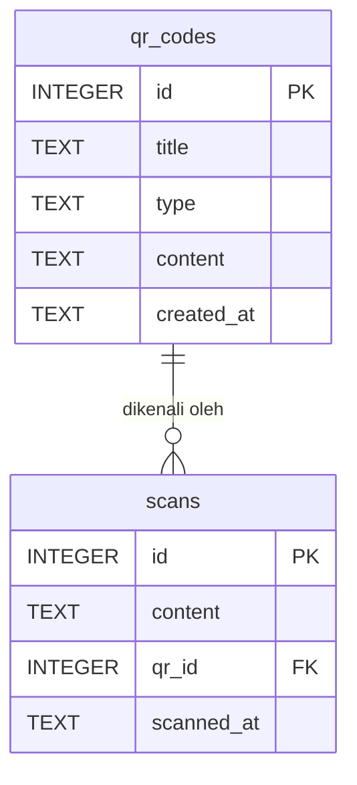

### Tabel `qr_codes`

| Kolom | Tipe | Keterangan |
|---|---|---|
| `id` | INTEGER PK AUTOINCREMENT | ID QR |
| `title` | TEXT NOT NULL | Judul yang diisi pengguna |
| `type` | TEXT NOT NULL | `text`, `url`, `phone`, `sms`, `email`, `wifi` |
| `content` | TEXT NOT NULL | Isi lengkap yang dikodekan dalam QR |
| `created_at` | TEXT NOT NULL | Waktu pembuatan (UTC), default `datetime('now')` |

Indeks: `idx_qr_content` pada kolom `content`.

### Tabel `scans`

| Kolom | Tipe | Keterangan |
|---|---|---|
| `id` | INTEGER PK AUTOINCREMENT | ID scan |
| `content` | TEXT NOT NULL | Isi QR yang terbaca |
| `qr_id` | INTEGER NULL | Rujukan ke `qr_codes.id` bila cocok; menjadi NULL jika QR-nya dihapus (`ON DELETE SET NULL`) |
| `scanned_at` | TEXT NOT NULL | Waktu scan (UTC) |

Waktu disimpan dalam UTC dan ditampilkan di frontend sesuai zona waktu perangkat.

### Backup dan reset

- **Backup:** hentikan server lalu salin berkas `backend/data/qrcode.db`.
- **Reset data:** hentikan server lalu hapus `qrcode.db`, `qrcode.db-wal`, dan `qrcode.db-shm`. Database kosong dibuat ulang saat server dijalankan.

---

## 11. Referensi REST API

Base URL: `https://<host>:3443`. Semua request dan response berformat JSON. Error dikembalikan sebagai `{ "error": "pesan" }`.

### 11.1 Daftar QR
`GET /api/qr`

Mengembalikan hingga 200 QR terbaru.

```json
[
  { "id": 1, "title": "Website", "type": "url",
    "content": "https://www.seeomkus.com", "created_at": "2026-10-08 09:03:14" }
]
```

### 11.2 Simpan QR baru
`POST /api/qr`

| Field | Tipe | Aturan |
|---|---|---|
| `title` | string | wajib, maksimal 100 karakter |
| `type` | string | salah satu: `text`, `url`, `phone`, `email`, `wifi`, `sms` |
| `content` | string | wajib, maksimal 2000 karakter |

Respons `201` berisi data QR yang tersimpan. Respons `400` jika data tidak valid.

### 11.3 Hapus QR
`DELETE /api/qr/:id` → `{ "ok": true }`

### 11.4 Daftar hasil scan
`GET /api/scans`

Mengembalikan hingga 200 scan terbaru, digabung dengan judul dan jenis QR bila cocok.

```json
[
  { "id": 1, "content": "https://www.seeomkus.com", "scanned_at": "2026-10-08 09:05:00",
    "qr_id": 1, "qr_title": "Website", "qr_type": "url" }
]
```

### 11.5 Simpan hasil scan
`POST /api/scans`

| Field | Tipe | Aturan |
|---|---|---|
| `content` | string | wajib, maksimal 4000 karakter |

Respons `201`:

```json
{
  "scan": { "id": 1, "content": "...", "qr_id": 1, "scanned_at": "..." },
  "qr": { "id": 1, "title": "Website", "type": "url", "content": "...", "created_at": "..." }
}
```

`qr` bernilai `null` jika isi tidak cocok dengan QR yang pernah dibuat.

### 11.6 Hapus hasil scan
`DELETE /api/scans/:id` → `{ "ok": true }`

### Contoh dengan curl

```bash
curl -k -X POST https://localhost:3443/api/qr \
  -H "Content-Type: application/json" \
  -d '{"title":"Website","type":"url","content":"https://www.seeomkus.com"}'
```

Opsi `-k` diperlukan karena sertifikat self-signed.

---

## 12. Konfigurasi

Konfigurasi memakai environment variable.

| Variabel | Default | Fungsi |
|---|---|---|
| `PORT` | `3443` | Port server |
| `HTTP` | (kosong) | Isi `1` untuk memakai HTTP biasa tanpa HTTPS. Kamera di HP **tidak akan berfungsi** lewat HTTP, kecuali diakses dari `localhost` |

Contoh:

```bash
PORT=8443 ./qr.sh start                    # Linux/macOS
```

```powershell
$env:PORT = "8443"; .\qr start             # Windows PowerShell
```

Server dijalankan dari folder `backend`, sehingga folder `data/` dan `../frontend/dist` dibaca relatif terhadap folder tersebut. Gunakan script `qr` atau `npm start` dari folder utama agar path sesuai.

---

## 13. Mode Pengembangan

Jalankan dua terminal:

```bash
# Terminal 1: backend dengan auto-reload
npm run dev:backend

# Terminal 2: frontend dengan hot reload (https://localhost:5173)
npm run dev:frontend
```

Server dev Vite memakai HTTPS (`@vitejs/plugin-basic-ssl`) dan meneruskan `/api` ke `https://localhost:3443`. Alamat jaringan Vite juga bisa dibuka dari HP untuk menguji kamera.

Pemeriksaan tipe:

```bash
npm --prefix frontend run build   # vue-tsc + vite build
npm --prefix backend run build    # tsc
```

Catatan: frontend memakai TypeScript 5.9 karena `vue-tsc` belum kompatibel dengan TypeScript versi yang lebih baru.

---

## 14. Keamanan dan Privasi

- Aplikasi **tidak memakai login**. Siapa pun yang dapat membuka alamat server di jaringan dapat melihat, membuat, dan menghapus data. Jalankan hanya di jaringan tepercaya.
- Data, termasuk password WiFi yang dimasukkan ke QR, disimpan **tanpa enkripsi** di SQLite. Jangan memasukkan data rahasia.
- Kamera hanya aktif saat halaman Scan dipakai dan dimatikan setelah QR terbaca, saat menekan **Berhenti**, atau saat berpindah halaman. Gambar kamera tidak dikirim ke server; hanya teks hasil scan yang disimpan.
- Backend memakai query berparameter (mencegah SQL injection), memangkas panjang input, dan membatasi ukuran body JSON 100 KB.
- Tombol **Buka** membuka tautan hasil scan. Berhati-hatilah dengan QR dari sumber tidak dikenal, karena tautannya bisa berbahaya.
- Sertifikat self-signed hanya untuk jaringan lokal. Untuk penggunaan di internet, pasang di balik reverse proxy dengan sertifikat resmi (misalnya Let's Encrypt) dan tambahkan autentikasi.

---

## 15. Pemecahan Masalah

| Masalah | Penyebab dan solusi |
|---|---|
| HP tidak bisa membuka halaman | Pastikan satu Wi-Fi dengan komputer, alamat IP benar, server berjalan, dan port 3443 diizinkan di Firewall (lihat [6.3](#63-firewall)) |
| Pesan "Kamera hanya bisa dipakai lewat HTTPS" | Buka dengan `https://`, bukan `http://`. Pastikan server tidak dijalankan dengan `HTTP=1` |
| Izin kamera ditolak | Ketuk ikon gembok di address bar Chrome → Izin → Kamera → Izinkan, lalu muat ulang. Di Android: Pengaturan Chrome → Setelan situs → Kamera |
| Kamera tidak ditemukan | Perangkat tidak punya kamera, atau kamera dinonaktifkan di sistem |
| Kamera sedang dipakai aplikasi lain | Tutup aplikasi lain yang memakai kamera (Zoom, Meet, dll.) |
| QR sulit terbaca | Tambah pencahayaan, dekatkan atau jauhkan kamera hingga QR jelas di dalam bingkai, atau gunakan **Dari Gambar** |
| Peringatan sertifikat muncul terus | Wajar untuk sertifikat self-signed. Pilih Advanced → Proceed |
| Alamat IP komputer berubah | Jalankan ulang `npm start`; sertifikat dibuat ulang otomatis dan alamat baru tercetak di terminal |
| `npm start` gagal: port sudah dipakai | Jalankan `qr status` lalu `qr stop` jika server lama dari proyek ini masih hidup; jika port dipakai aplikasi lain, gunakan `PORT` lain |
| Halaman kosong / 404 pada frontend | Jalankan `npm run build` terlebih dahulu agar `frontend/dist` tersedia |
| Error saat memasang `better-sqlite3` | Gunakan Node.js versi LTS agar berkas prebuilt tersedia; jika tidak, pasang build tools C++ |

---

## 16. Keterbatasan dan Pengembangan Lanjutan

Keterbatasan versi ini:
- Hanya diuji untuk Google Chrome.
- Tanpa autentikasi dan tanpa pemisahan data antar pengguna.
- Satu QR tidak bisa diedit setelah dibuat (hapus lalu buat ulang).
- Tidak ada penyesuaian warna atau logo pada QR Code.

Ide pengembangan:
- Login dan pemisahan data per pengguna.
- Jenis QR tambahan: kontak (vCard), lokasi, kalender.
- Kustomisasi tampilan QR (warna, logo) dan unduhan SVG.
- Ekspor riwayat ke CSV.
- Dukungan PWA agar dapat dipasang di layar utama HP.
- Dukungan browser lain.

---

*SeeOmKus · [www.seeomkus.com](https://www.seeomkus.com) · Oktober 2026*
